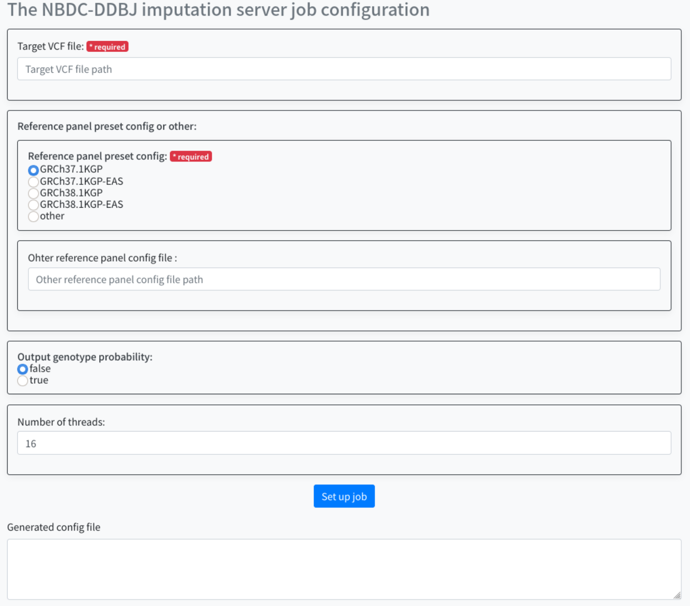
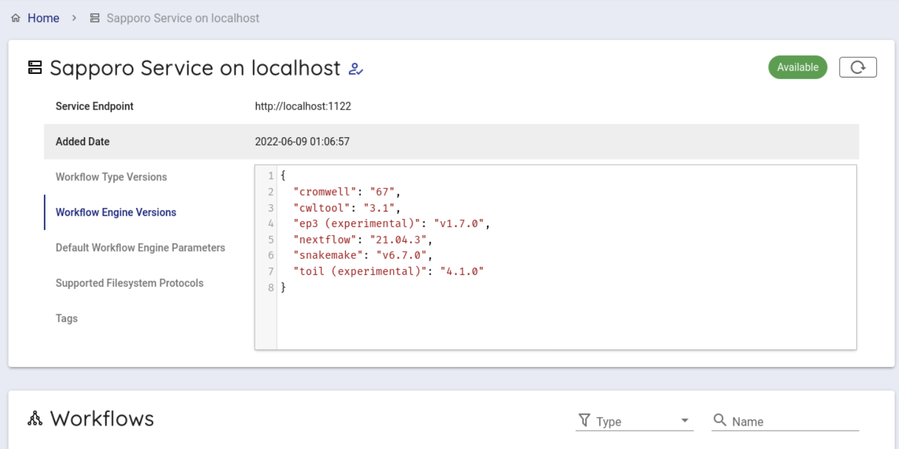
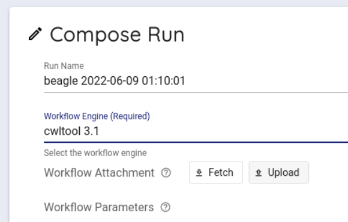
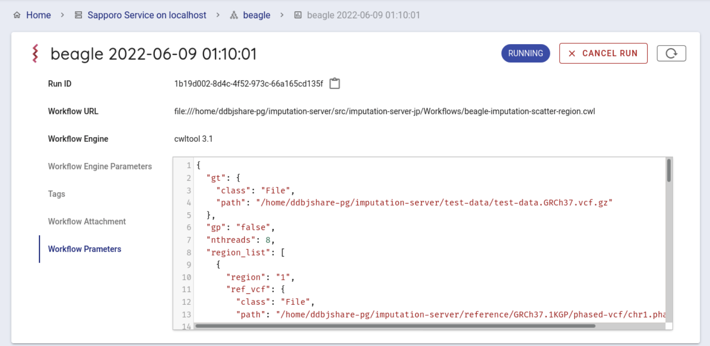
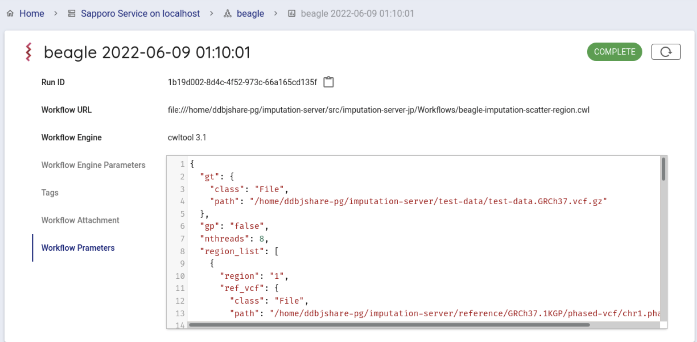

## システム利用方法

本システムでは、以下の流れでワークフローを実行します。

1. テストデータの準備
2. Imputation Workflow用の設定ファイルの生成
3. Imputation Workflowの実行

## テストデータの準備

チュートリアルをすすめるにあたって、使用するテストデータをダウンロードし、遺伝研スパコン個人ゲノム解析区画へコピーします。

### テスト用データのダウンロード

[&#x1f517;<u>Test data for Imputation Workflow</u>](https://zenodo.org/record/6650681#.YrD-HOxBykr)にアクセスします。以下の２つのファイルがおいてあります。

- `test-data.GRCh37.vcf.gz`
- `test-data.GRCh38.vcf.gz`

今回は、`test-data.GRCh37.vcf.gz`を使うので、これをダウンロードします。

`test-data.GRCh38.vcf.gz`であっても、操作の流れは同じで、必要に応じて、GRCh38を選択していただければ問題なく進めていただけます。


### 遺伝研スパコン個人ゲノム解析区画へコピーします。

さきほどダウンロードしたテストデータをコピーします。

遺伝研スパコンへ接続するためのVPNを接続してください。

次に、さきほどダウンロードしたテストデータを次のコマンドでコピーします

以下の例では、コピーしたいテストデータは、ダウンロードフォルダの中にあり、コピー先は、遺伝研スパコン個人ゲノム解析区画のお使いのアカウントのホームディレクトリになります。

```
scp -i 秘密鍵ファイル ~/ダウンロード/test-data.GRCh37.vcf.gz (お使いのアカウント名)@gwa.ddbj.nig.ac.jp:~/
```

これでテストデータの準備は終了です。

## Imputation Workflow用の設定ファイルの生成

遺伝研スパコンのguacamole 経由で以下のアドレスにアクセスします。

```text
http://localhost:5000
```

実際にアクセスすると、次のような画面になります。



以下の項目について設定を行います。

- Target VCF file
- Reference panel preset config or other
- Output genotype probability
- Number of threads

Target VCF file には、解析対象の VCFファイル (\*.vcf.gz ファイル) のフルパスを指定します。
ここでは先程アップロードした、ファイルを使います。
具体的なフルパスは `/home/ユーザ名/test-data.GRCh37.vcf.gz`のようになります。

次にReference panel preset config orを選択します。
デフォルトで以下の４つについて、選択が可能です。

- GRCh37.1KGP
- GRCh37.1KGP-EAS
- GRCh38.1KGP
- GRCh38.1KGP-EAS

それぞれについては[&#x1f517;<u>利用可能なリファレンスパネルの種類</u>](https://sc.ddbj.nig.ac.jp/advanced_guides/imputation_server/#%E5%88%A9%E7%94%A8%E5%8F%AF%E8%83%BD%E3%81%AA%E3%83%AA%E3%83%95%E3%82%A1%E3%83%AC%E3%83%B3%E3%82%B9%E3%83%91%E3%83%8D%E3%83%AB%E3%81%AE%E7%A8%AE%E9%A1%9E)を参照ください。

上記以外のものをReference Panelとして使いたいときはother を選択し、Reference panel config fileに使いたいものを指定します。

Output genotyhpe probabilityを選択します。
以下の２種類が選択可能です。デフォルトでは falseが選択されています。

- false
- true

Number of threadsは、ワークフローを実行する際のジョブのスレッド数を指定します。

デフォルトでは、16 が指定されています。

パラメータの指定が終わったら、Set up job ボタンを押します。
画面下部に、生成されたパラメータが表示されます。これをsapporo-web で使います。


赤く塗りつぶされているところは、お使いのアカウント名になります。

## Imputation Workflowの実行

guacamole 経由で、以下のアドレスにアクセスします。

```text
http://localhost:1121
```

以下のような画面が表示されます。


次に、デフォルトで使用可能になっている Sapporo Service on localhost を選択します。

クリックすると以下のような画面がでてきます。



次にバックエンドワークフローを使用するために少し下にスクロールし、
Workflows という項目から beagle をクリックします。


Compose Run の項目から、Workflow Engine の項目で `cwltool 3.1` を選択します。



Workflow Parameters に先程、 imputationserver-web-uio で生成したパラメータを入力します。
このとき、最初から書かれている `{}` を消して、生成したパラメータを入力します。


一番下にあるExecute ボタンを押して、ワークフローを実行します。
ジョブの状態がRunning になります。



正常にワークフローの実行が開始されるとcwltoolでワークフローが実行されます。

正常に終了すると `COMPLETE` になります。



結果ファイルは、ブラウザから取得が可能です。
Run log の中の、Outputs をクリックすると結果ファイル一覧が表示されます。

ダウンロードしたいファイルをクリックするとダイアログが表示され、デフォルトでは、 `~/ダウンロード` 以下にダウンロードされます。

### 結果の取得

Imputation Workflow 実行後、以下のものが取得できます。

ウェブブラウザから取得ができます。

以下のコマンドを、手元のパソコンにコピーすることが可能です。

ターミナルを開きます。

実行すると、現在コマンドを実行しているディレクトリにファイルがダウンロードされます。

```console
scp (お使いのアカウント名)@gwa.ddbj.nig.ac.jp:~/ダウンロード/(ダウンロードしたいファイル名) .
```

- `(お使いのアカウント名)` は、個人ゲノム解析環境へのログインに使用するアカウントです
- `(ダウンロードしたいファイル名)` に、ダウンロードしたいファイル名を指定します。

また、sapporo-serviceの結果ディレクトリから直接ダウンロードすることも可能です。

`Run ID`を調べます。
`Run ID` の右に表示されているものが `Run ID` です。
右にあるアイコンをクリックすることで、 `Run ID` (以下runid)をコピーすることが可能です。


インストールしたディレクトリ/sapporo-service/run/`runid`の最初の２文字/`runid`/outputs/ 以下にすべてのファイルがあります。

`runid`が`1b19d002-8d4c-4f52-973c-66a165cd135f`の場合、最初の２文字は `1b` になります。

scpでコピーするときは、お手元の計算機に以下のように入力します。
手元の計算機に、`outputs` というディレクトリが作成され、その中に解析結果が個人ゲノム解析区画から、お手元の計算機にコピーされてきます。

```
scp -i 秘密鍵ファイル -r (お使いのアカウント名)@gwa.ddbj.nig.ac.jp:~/sapporo-install/sapporo-service/run/1b/1b19d002-8d4c-4f52-973c-66a165cd135f/outputs outputs
```

