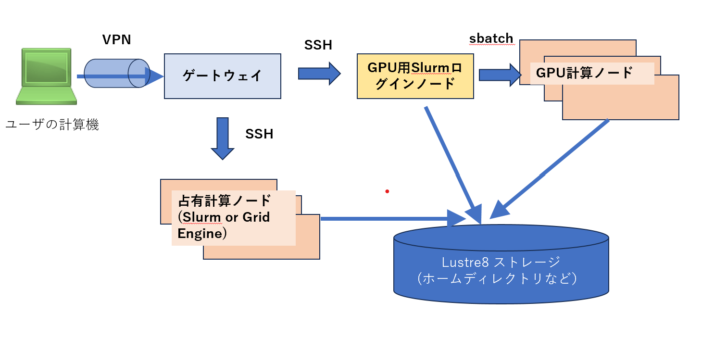

## 概要

遺伝研スパコン個人ゲノム解析区画では Slurm リソーススケジューラ配下で管理した GPU ノードに対してジョブを投入することができます。

この Slrum クラスタは Parabricks を使用するために GPU ノードの全 GPU (4 つ)をすべて使う想定となりますので同時に同じ GPU ノードに別のユーザのジョブが入ることはありません。




## 利用の準備

1. 課金サービスになりますので利用計画表を提出してください。
2. GPU 用 Slurm 計算ノードにユーザホームの作成(シンボリック)を行いますので、利用されるおおよその期間を利用計画表の「利用目的等」に記載いただくか、メールでお知らせください。
3. Parabrick を rootless docker での実行を希望する場合、
　subuid, subgid の割り当てを実施する必要がありますので、その旨を利用計画表の「利用目的等」に記載いただくか、メールでお知らせください。（※Apptainer(Singularity) にて利用される場合は設定不要です。）


## Apptainer による利用手順

以下の手順では Parabricks v4.0 を apptainer のイメージファイルを使用して実行します。(Apptainer 自体の説明は[Apptainer(Singularity) の使い方](/software/Apptainer)のページをご参照ください。)

Parabricks イメージファイルはユーザが用意したものか、遺伝研スパコンに配置した`/opt/pkg/nvidia/parabricks`以下のものが利用可能です。

### Slurm GPU キュー用ログインノードし、ジョブを投入する。
ジョブを投入可能なフロントサーバー at022vm02 を用意しています。

前提条件
* gwa.ddbj.nig.ac.jp にログイン済みである。

Slurm GPU キュー用ログインノードへログインします。
```
$ ssh at022vm02
```

サンプルデータのダウンロードを行います。
(/home/$(id -un)/で実行したとします)
```
$ wget -O parabricks_sample.tar.gz "https://s3.amazonaws.com/parabricks.sample/parabricks_sample.tar.gz"
```

ダウンロードしたファイルを展開し、parabricks_sample ディレクトリが作成されたことを確認します。
```
$ tar -zxf parabricks_sample.tar.gz
$ ls
................    parabricks_sample    ................   ................   ................ 

```

ジョブスクリプトを作成します。
本手順では`test.sh`という名前のスクリプトを以下の内容で作成します。

* ジョブスクリプト`test.sh`の記載内容
```
#!/bin/bash
#
#SBATCH --partition=all # ここでは all を選択
#SBATCH --job-name=test
#SBATCH --output=res.txt
#SBATCH --mem 384000 # 単位 MB, GPU ノードの全メモリ 384GB を確保する

apptainer exec --nv --bind /home/$(id -un):/input_data /opt/pkg/nvidia/parabricks/clara-parabricks_4.0.0-1.sif \
  pbrun fq2bam \
    --ref /input_data/parabricks_sample/Ref/Homo_sapiens_assembly38.fasta \
    --in-fq /input_data/parabricks_sample/Data/sample_1.fq.gz /input_data/parabricks_sample/Data/sample_2.fq.gz \
    --out-bam /input_data/parabricks_sample/fq2bam_output.bam
```

なお、本 Slurm クラスタのパーティション(AGE におけるキュー相当)では、igt009, igt016, all の 3 種類を用意しています。

```
$ sinfo -l
Mon Mar 13 10:44:04 2023
PARTITION AVAIL  TIMELIMIT   JOB_SIZE ROOT OVERSUBS     GROUPS  NODES       STATE NODELIST
igt009       up   infinite 1-infinite   no       NO        all      1    reserved igt009
igt016       up   infinite 1-infinite   no       NO        all      1    reserved igt016
all*         up   infinite 1-infinite   no       NO        all      2    reserved igt[009,016]

```


ジョブをサブミットします。
```
$ sbatch test.sh
```

ジョブがサブミットされたことを確認します。
```
$ squeue 
             JOBID PARTITION     NAME     USER ST       TIME  NODES NODELIST(REASON)
                56       all     test  pg-user PD       0:00      1 (ReqNodeNotAvail, May be reserved for other job)
$
```

ジョブ実行が完了したら、出力ログおよび結果ファイルを確認します。
```
$ cat res.txt
$ ls parabricks_sample/
Data   Ref   fq2bam_output.bam   fq2bam_output.bam.bai   fq2bam_output_chrs.txt
```
* res.txt … 出力ログ
* fq2bam_output.bam, fq2bam_output.bam.bai, fq2bam_output_chrs.txt… 結果ファイル


## Rootless Docker による利用手順

Parabricks による解析を Rootless Docker を用いて実行するための利用手順を記します。

1. 各 Worker ノード(GPU ノード)にログインし、Rootless Docker を起動する。
2. Slurm GPU キュー用ログインノードし、ジョブを投入する。

### 各 Worker ノード(GPU ノード)にログインし、Rootless Docker を起動する。

Rootless Docker は root（管理者アカウント）ではない一般アカウントでも起動・実行できる Docker のことです。通常の Docker は root のみ起動・実行が可能です。
Parabricks のコンテナを実行するために本手順を実施します。

参考: https://docs.nvidia.com/clara/parabricks/4.0.0/GettingStarted.html#gettingstarted


前提条件
* gwa.ddbj.nig.ac.jp にログイン済みである。
* Rootless Docker を起動するサーバは igt009 と igt016 の 2 台とする。


Rootless Docker の起動時に必要となるディレクトリ、ファイルを Lustre 上の自身のホームディレクトリに作成します。
```
$ mkdir -p /home/$(id -un)/.docker/run_igt009
$ mkdir -p /home/$(id -un)/.docker/run_igt016
$ mkdir -p /home/$(id -un)/.config/docker
$ cat <<EOF > /home/$(id -un)/.config/docker/daemon.json
{"data-root":"/data1/rootless-docker-$(id -un)"}
EOF
```

以降は GPU ノードへの設定作業です。
現在 igt009、igt016 の 2 台で構成しており、それぞれに設定が必要です。

GPU ノードにログインします
```
$ ssh <GPU ノード名 igt009 or igt016>
```

GPU ノードの NVMe 領域(/data1)に Parabricks の中間ファイルなどが出力されるディレクトリを作成します。

```
$ mkdir /data1/rootless-docker-$(id -un); chmod 750 /data1/rootless-docker-$(id -un)/;
```

Rootless Docker を起動します。
```
$ dockerd-rootless.sh --experimental --storage-driver vfs &

```

Parabricks の Docker イメージを pull します。
以下の例ではバージョン 4.0.0-1 の Docker イメージを取得しています。
```
$ docker pull nvcr.io/nvidia/clara/clara-parabricks:4.0.0-1
```

GPU ノードからログアウトします。
```
$ exit
```

### Slurm GPU キュー用ログインノードし、ジョブを投入する。
ジョブを投入可能なフロントサーバー at022vm02 を用意しています。

前提条件
* gwa.ddbj.nig.ac.jp にログイン済みである。
* Parabricks を実行する場合、前述の手順で Rootless Docker を起動済みであること。

Slurm GPU キュー用ログインノードへログインします。
```
$ ssh at022vm02
```

サンプルデータのダウンロードを行います。
(/home/$(id -un)/で実行したとします)
```
$ wget -O parabricks_sample.tar.gz "https://s3.amazonaws.com/parabricks.sample/parabricks_sample.tar.gz"
```

ダウンロードしたファイルを展開し、parabricks_sample ディレクトリが作成されたことを確認します。
```
$ tar -zxf parabricks_sample.tar.gz
$ ls
................    parabricks_sample    ................   ................   ................ 

```

ジョブスクリプトを作成します。
本手順では`test.sh`という名前のスクリプトを以下の内容で作成します。
※「source /etc/profile.d/rootless-docker.sh」は必要な環境変数を定義しているので、必ず記入してください。


* ジョブスクリプト`test.sh`の記載内容
```
#!/bin/bash
#
#SBATCH --partition=all # ここでは all を選択
#SBATCH --job-name=test
#SBATCH --output=res.txt

source /etc/profile.d/rootless-docker.sh

docker run --gpus all --rm --volume /home/$(id -un):/input_data nvcr.io/nvidia/clara/clara-parabricks:4.0.0-1 pbrun fq2bam --ref /input_data/parabricks_sample/Ref/Homo_sapiens_assembly38.fasta --in-fq /input_data/parabricks_sample/Data/sample_1.fq.gz /input_data/parabricks_sample/Data/sample_2.fq.gz --out-bam /input_data/parabricks_sample/fq2bam_output.bam
```

なお、本 Slurm クラスタのパーティション(AGE におけるキュー相当)では、igt009, igt016, all の 3 種類を用意しています。

```
$ sinfo -l
Mon Mar 13 10:44:04 2023
PARTITION AVAIL  TIMELIMIT   JOB_SIZE ROOT OVERSUBS     GROUPS  NODES       STATE NODELIST
igt009       up   infinite 1-infinite   no       NO        all      1    reserved igt009
igt016       up   infinite 1-infinite   no       NO        all      1    reserved igt016
all*         up   infinite 1-infinite   no       NO        all      2    reserved igt[009,016]

```


ジョブをサブミットします。
```
$ sbatch test.sh
```

ジョブがサブミットされたことを確認します。
```
$ squeue 
             JOBID PARTITION     NAME     USER ST       TIME  NODES NODELIST(REASON)
                56       all     test  pg-user PD       0:00      1 (ReqNodeNotAvail, May be reserved for other job)
$
```

ジョブ実行が完了したら、出力ログおよび結果ファイルを確認します。
```
$ cat res.txt
$ ls parabricks_sample/
Data   Ref   fq2bam_output.bam   fq2bam_output.bam.bai   fq2bam_output_chrs.txt
```
* res.txt … 出力ログ
* fq2bam_output.bam, fq2bam_output.bam.bai, fq2bam_output_chrs.txt… 結果ファイル
