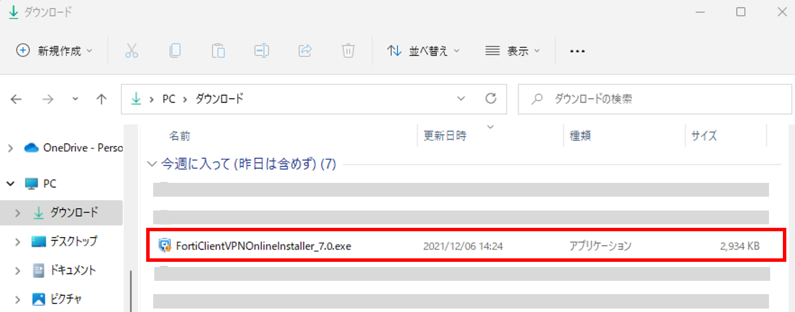
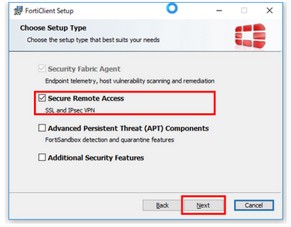

## SSL-VPN クライアントソフトウェア「FortiClient」のダウンロード方法

1. 以下のURLをクリックして、ForiClientの公式サイトのページにアクセスします。いくつかソフトウェアが表示されますが、そのうちの「FortiClient VPN only」をダウンロードしてください。
	- FortiClient公式サイト: [https://www.forticlient.com/downloads](https://www.forticlient.com/downloads)

より詳しくダウンロード方法を知りたい場合は、[FAQ](/faq/faq_login_personal#how-to-DL-VPN)をご参照ください。

## SSL-VPN クライアントソフトウェア「FortiClient」のインストール方法

1. ダウンロードフォルダに保存されたインストールプログラムを実行します。
「ユーザーアカウント制御」が表示された場合は［はい］を選択して許可します。

2. 「Yes, I have read and accept the」にチェックを付け、「Next」をクリックします。

3. ユーザの計算機のセットアップの種類を選択します。

選択する種類は、ユーザの計算機にウィルスチェックソフトが入っているか否かで異なります。

- **必ず以下の画像の通りにチェックボックスにチェックされていることを確認してください。**
- **その他のチェックされていない項目にチェックが入っていると、正常に動作しない恐れがあります。**

【ユーザの計算機にウイルスチェックソフトが入っている場合】

Choose Setup Typeで「Secure Remote Access」にチェックが入っていることを確認し、「Next」をクリックします。

【ユーザの計算機にウイルスチェックソフトが入っていない場合】

Choose Setup Typeで「Secure Remote Access」と「Additional Security Features」と「AntiVirus」にチェックが入っていることを確認し、「Next」をクリックします。

4. Destination Folderではそのまま「Next」をクリックします。※通常、変更は不要です。

5. 「install」をクリックします。クリックすると、インストールが開始されます。

6. 「Finish」をクリックします。クリックすると、インストール完了となります。

