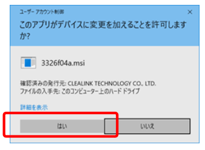

## インストーラの入手

以下のリンクから、HCP toolsクライアントソフトウェアのzipファイルを入手して下さい。

<ul>
    <li>HCP_Tools_Client.msi</li>
    <li>HCP_Tools_Client.md5sum</li>
</ul>


過去のバージョンなどは<a href="https://github.com/oogasawa/nigsc_HCPtools">こちらからダウンロード可能です。</a>


### クライアントソフトウェアのインストール


インストーラ<font color="blue">HCP_Tools_Client.msi</font> をダブルクリックして起動します。

「使用許諾契約書に同意します(A)」にチェックを入れ、「インストール(I)」ボタンをクリックして下さい。


デバイスの変更許可に「はい」と応えると、インストールが開始します。




インストール後、実行コマンドが、`C:\Program Files`の下に、設定ファイルが`C:\ProgramData`の下に存在することを確認して下さい。

- 実行コマンド : 'C:\Program Files\Clealink\HCP Tools\hcp.exe'
- 設定ファイル: 'C:\ProgramData\Clealink\HCP Tools\hcp.conf'


ユーザディレクトリに`_hcp`ディレクトリを作成し、その中にHCP toolsに必要な設定ファイルをコピーします。

```bash
mkdir C:\Users\ユーザ名\_hcp
cp C:\ProgramData\Clealink\HCP Tools\*.conf C:\Users\ユーザ名\_hcp
```

HCP Toolsのユーザ認証には、遺伝研スパコンのSSH公開鍵・秘密鍵ファイルを使用します。
ユーザディレクトリ`C:\Users\ユーザ名\.ssh`の下に秘密鍵ファイル(`id_rsa`)が置かれていることを確認してください。

SSH公開鍵暗号方式によるユーザ認証の説明はこちらをご覧ください。


動作確認

遺伝研スパコン個人ゲノム解析区画に対してVPNの接続をした後、
PowerShellを起動し、以下のコマンドを実行すると、ファイルのアップロードができます。


PowerShellから以下のコマンドを実行すると、ファイルのダウンロードができます。


