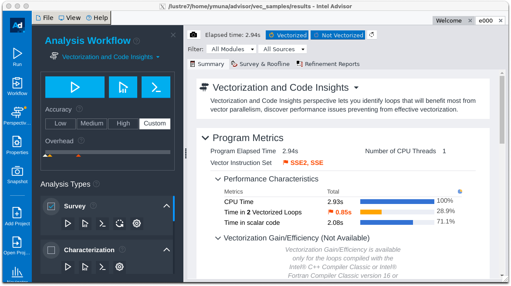
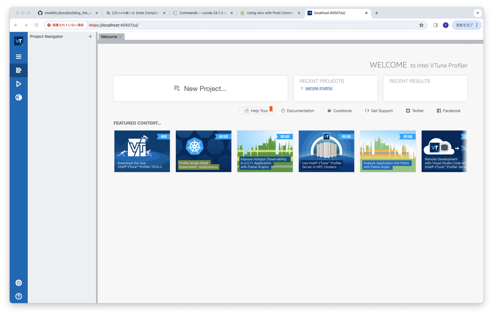
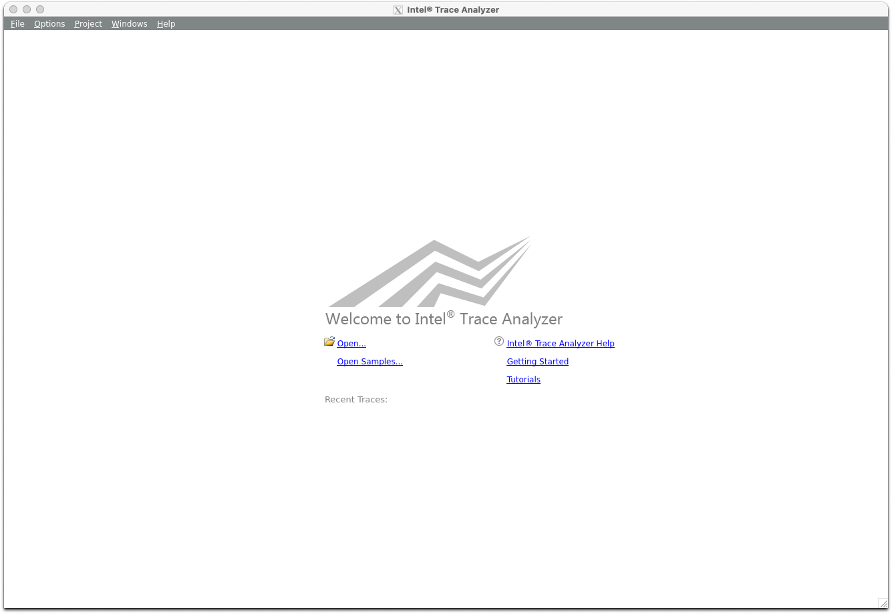

## Intel Advisor

C,C++,C#,Fortranソフトウェア開発者向けの高性能ベクトル化／スレッド化プロトタイプ生成・チューニングツールです。ベクトル化を安全かつ効率的に行えるように、並列可能部分の抽出の為のデータを取得します。遺伝研スパコンでは以下のディレクトリにインストールされています。

```
/lustre7/software/intel_ubuntu/oneapi/advisor/2023.2.0/bin64/advisor
```

- [販売元の製品ページ](https://www.xlsoft.com/jp/products/intel/advisor/index.html)
- [旧バージョンの日本語ユーザガイド](https://www.isus.jp/wp-content/uploads/advisor/2023/advisor_user_guide/index.htm)
- [インテルのチュートリアル](https://www.intel.com/content/www/us/en/docs/advisor/get-started-guide/2023-1/overview.html)

|コマンド|説明|
|---------|----------|
|advisor  |advisorのCLI版|
|advisor-gui| advisorのGUI版|

遺伝研スパコン上での利用方法としては、性能評価ジョブを計算ノードにバッチジョブとして投入し、得られた結果をログインノード上のadvisorで
評価するという利用形態になります。以下に順に説明します。

### 実行ファイルのコンパイル

評価情報を収集するために、プログラムのコンパイル時に`-g`オプションを指定する必要があります。
```
icpx ソースファイル名 -g
```

### 解析情報の取得

コマンドラインツールadvisorを利用して解析情報を取得します。ここではサンプルプログラム名はvec_samplesというものを利用した例を記載しています。

```
(base) yxxxx@at137:~/advisor/vec_samples$ advisor --collect=survey --project-dir=./results -- ./vec_samples 
Intel(R) Advisor Command Line Tool
Copyright (C) 2009-2023 Intel Corporation. All rights reserved.
advisor: Collection started. To stop the collection, either press CTRL-C or enter from another console window: advisor -r /lustre7/home/yxxxx/advisor/vec_samples/results/e000/hs000 -command stop.

ROW:47 COL: 47
Execution time is 2.936 seconds
GigaFlops = 1.504849
Sum of result = 254364.540283
advisor: Collection stopped.
advisor: Opening result 99 % done                                              
advisor: Preparing frequently used data  0 % done                              
advisor: Preparing frequently used data 100 % done                             
advisor: Warning: Higher instruction set architecture (ISA) available 

Program Elapsed Time: 2.94s

CPU Time: 2.94s
Time in 2 Vectorized Loops: 0.85s
```
上記の手順では、./resultsディレクトリの中に、取得した解析情報が格納されます。


### CLIでの解析結果の確認方法

以下のようなコマンドラインの指定で、レポートファイルをCLIで出力することも可能です。

```
advisor -report survey -project-dir ./result -format=text -report-output ./result/report.txt
```
report.txtの内容は以下のようになります。オプションの指定により、レポートされる内容を追加することも可能です。
```
Intel(R) Advisor Command Line Tool
Copyright (C) 2009-2023 Intel Corporation. All rights reserved.
Survey Data version="1.1.0"

ID     Function Call Sites and Loops      Total Time   Self Time          Type           Why No Vectorization   Vector ISA   Compiler Estimated Gain   Transformations   Source Location     Module      
_________________________________________________________________________________________________________________________________________________________________________________________________________
 4   [loop in matvec at Multiply.c:69]        2.122s      2.122s                Scalar                                                                                     Multiply.c:69   vec_samples   
 9   [loop in matvec at Multiply.c:82]        0.710s      0.710s   Vectorized Versions                                 SSE                                                 Multiply.c:82   vec_samples   
 7   -[loop in matvec at Multiply.c:82]       0.566s      0.566s     Vectorized (Body)                                 SSE                                                 Multiply.c:82   vec_samples   
 2   -[loop in matvec at Multiply.c:82]       0.144s      0.144s                Scalar                                                                                     Multiply.c:82   vec_samples   
 3   [loop in matvec at Multiply.c:49]        3.448s      0.392s                Scalar                                                                                     Multiply.c:49   vec_samples   
 8   [loop in matvec at Multiply.c:60]        0.224s      0.224s   Vectorized Versions                                 SSE                                                 Multiply.c:60   vec_samples   
 6   -[loop in matvec at Multiply.c:60]       0.196s      0.196s     Vectorized (Body)                                 SSE                                                 Multiply.c:60   vec_samples   
 5   -[loop in matvec at Multiply.c:60]       0.028s      0.028s                Scalar                                                                                     Multiply.c:60   vec_samples   
 1   [loop in main at Driver.c:155]           3.460s          0s                Scalar                                                                                      Driver.c:155   vec_samples   

```

### GUIでの解析結果の確認方法

GUI版のAdvisorの起動、確認手順を示します。AdvisorのGUI版はXアプリケーションである為、手元のPCにXサーバ環境が立ちあがって
いることを前提とします。

まず、Advisorを立ち上げるログインノードにqloginでログインしておきます。ログインしたホスト名を確認しておきます。

次に手元の端末からsshでXのsshトンネル環境を設定して行きます。まずゲートウェイノードに`-CX`オプションを指定して接続します。

```
ssh -l ユーザ名 -CX gw.ddbj.nig.ac.jp
```
次に先ほどqloginでログインしたログインノードに対して`-CX`オプションを付けてさらにログインします。

```
ssh -CX ログインノード名
```
ログインしたら、DISPLAY環境変数を確認します。
```
$ echo $DISPLAY
localhost:13.0
```
このターミナルはsshトンネル設定の為に使用しています。作業中は開いたままにし、これ以上このターミナル上で
作業しないでください。（ジョブ管理システム管理外になるため）

DISPLAY環境変数を、qloginしたターミナル上で設定します。
```
export DISPLAY＝localhost:13.0
echo $DISPLAY
localhost:13.0
```
Advisorを起動します。ここでは引数として解析情報が格納されたディレクトリを指定します。
```
advisor-gui ./results
```
以下の画面が手元のPC上で表示されます。


GUIが立ち上がったら、show resultボタンを押します。しばらくすると以下の結果表示画面が表示されます。




## Intel VTune　プロファイラー
パフォーマンス分析ツールです。

- [販売元の製品ページ](https://www.xlsoft.com/jp/products/intel/VTune/index.html)
- [インテルのユーザガイド（英語)](https://jp.xlsoft.com/documents/intel/vtune/2024/vtune-profiler-user-guide.pdf)
- [販売元が翻訳したVTuenのパフォーマンス解析クックブック](https://jp.xlsoft.com/documents/intel/vtune/2021/Intel_VTune_Profiler_Performance_Analysis_Cookbook.pdf)

VTuneについては、Webサーバ(vtune-backend)版がありますので、ログインノード上でvtune-backendを起動して、ユーザPCから接続して利用
する方法についてここでは説明します。
以下の説明は、Intel社の以下の記事を参考にして記述しています。

- [Intel VTune Profiler Performance Analysis Cookbook](https://www.intel.com/content/www/us/en/docs/vtune-profiler/cookbook/2023-0/vtune-profiler-server-in-hpc.html)

まず、qloginでログインしたインタラクティブノード上で、vtune-backendを起動しておきます。

```js
//highlight-next-line
vtune-backend --web-port=40507 --enable-server-profiling --data-directory=~/vtune-data --reset-passphrase
No TLS certificate was provided as a --tls-certificate command-line argument thus a self-signed certificate is generated to enable secure HTTPS transport for the web server: /home/yxxxx/.intel/vtune/settings/certificates/middleware.crt. 
//highlight-next-line
VTune Profiler GUI is accessible via https://127.0.0.1:40507/?one-time-token=c623b26caf9c08c12cf448c03ebb0a29
```
上記で利用しているvtune-backendのオプションは以下になります。
- `--web-port` vtune-backendを立ち上げるポート番号を指定します。ここでは例として40507を指定しています。
- `--enable-server-profiling` サーバプロファイリングを有効にします。これは常時付けてください。
- `--data-directory` プロファイリングで利用するデータファイルがおいてあるディレクトリを指定します。
- `--reset-passphrase`　Web画面にアクセスする際にパスフレーズを要求するようにします。初回はパスフレーズの登録が要求されます。

次に、sshのポートフォワーディングを利用して、sshのトンネルを作成します。
以下のコマンドをローカルPCのターミナルに入力してゲートウェイノードにログインします。
```
ssh -L 127.0.0.1:40507:127.0.0.1:40507 gw.ddbj.nig.ac.jp
```
次にゲートウェイノードから、vtune-backendが立ち上がっているログインノードにsshをかけます。
```
ssh -L 127.0.0.1:40507:127.0.0.1:40507 ログインノード名
```
上記のssh接続でログインしたターミナルはそのままにしてください。ターミナルを閉じるとsshトンネルも終了します。またログインノードへの作業
の為のログインはqloginでログインしてください。この作業はsshトンネルを接続する為のみに実施しています。ここで開いたターミナル上では作業しないでください。

手元のPC上でブラウザを起動し、

`http://127.0.0.1:40507`

に、上記の画面で表示されていた、ワンタイムトークン

`?one-time-token=c623b26caf9c08c12cf448c03ebb0a29`

を追加したURL

`http://127.0.0.1:40507/?one-time-token=c623b26caf9c08c12cf448c03ebb0a29`

をブラウザに入力してアクセスします。すると以下の画面が表示されます。


profilerにアクセスする為のパスフレーズの登録を要求されているので、任意のパスフレーズを登録します。
登録後、以下のプロファイラの画面が表示されます。



プロファイラの使用方法については、ユーザガイドを参照してください。


## Intel Trace Analyzer & Collector
MPIアプリケーションのパフォーマンス分析・チューニング・ツールです。Intel MPIライブラリとともに利用し、トレース情報からパフォーマンス分析、チューニングを行います。

|コマンド|説明|
|------|----|
|traceanalyzer|トレースアナライザ　GUI版|

基本的な使い方としては、プログラムの実行時にmpirunコマンドの-traceオプションを付けて実行、MPIトレース情報をトレースファイルに取得し、トレースファイルをtraceanalyzerで分析することになります。


- [販売元の製品ページ](https://www.xlsoft.com/jp/products/intel/cluster/tatc/index.html)
- [インテルの製品ページ](https://www.intel.com/content/www/us/en/docs/trace-analyzer-collector/get-started-guide/2021-10/overview.html)

以下のコマンドをバッチスクリプト内に記述してジョブを起動します。ここでmpirunはインテルMPIのmpirunであることを確認してください。

```
mpirun -trace your_program
```
実行が完了すると、実行ファイル名.stf というファイルができるので、これを読み込んで解析にかけます。

### CLIでのトレース確認方法

以下のコマンドでレポートファイルを生成することが可能です。

```
traceanalyzer --cli -o report.txt --messageprofile  stfファイル名
```

### GUIでのトレース確認方法

traceanalyzerのGUIはXアプリケーションなので、sshによるXポートフォワーディングの設定を行なった上で、
```
traceanalyzer
```
とコマンドを入力すると以下の画面が表示されます。



この画面で、FileメニューからOpenを選択してstfファイルを読み込んで解析をかけてください。MPIの通信パターンを
確認できます。


細かい使用方法については、前述のインテル社のページを参照してください。


