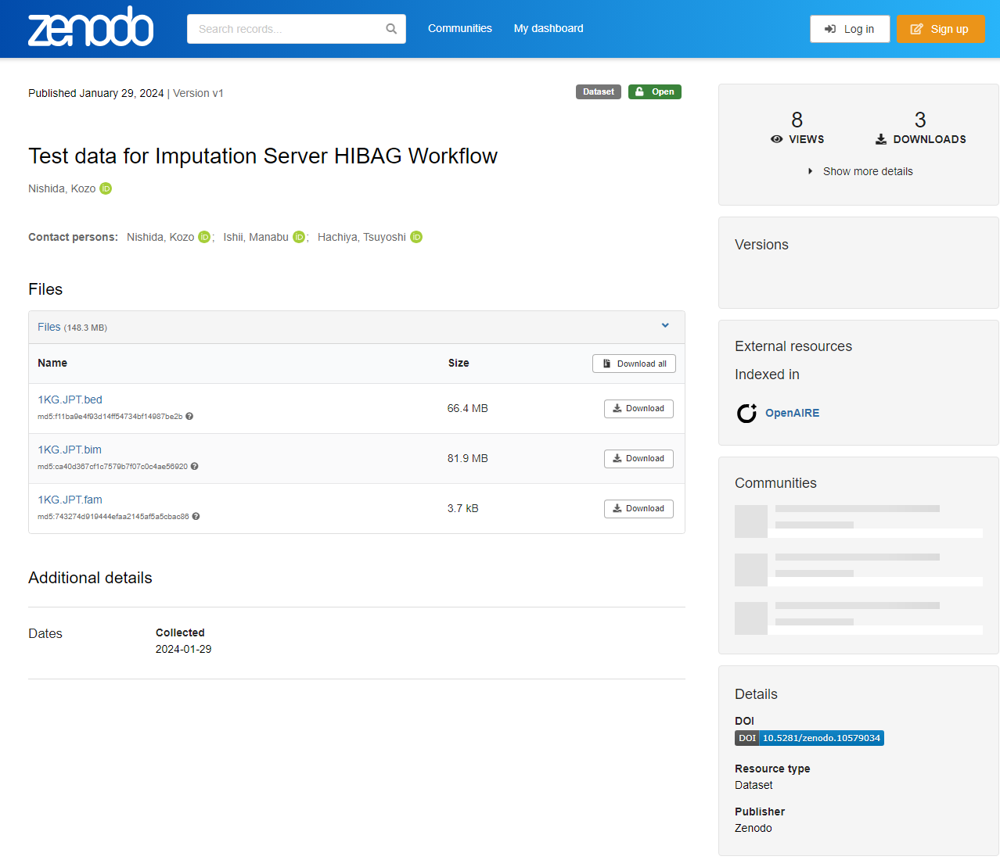
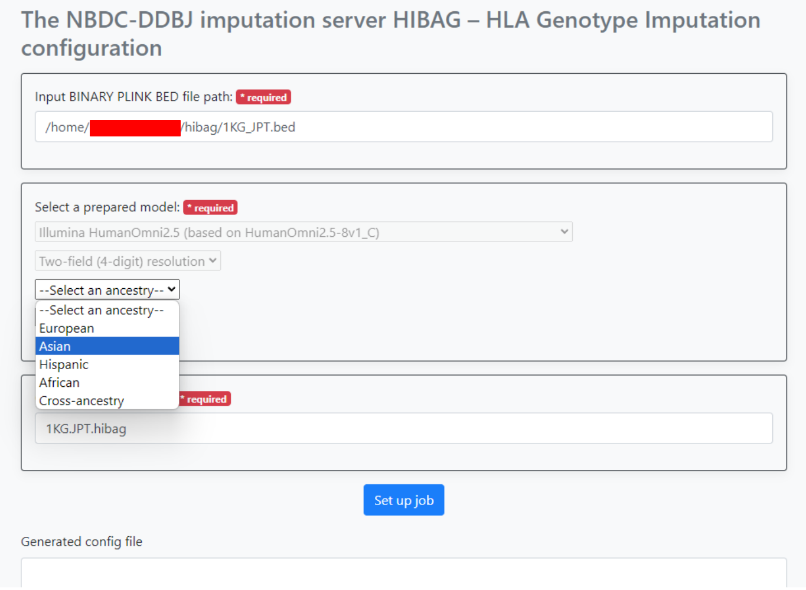
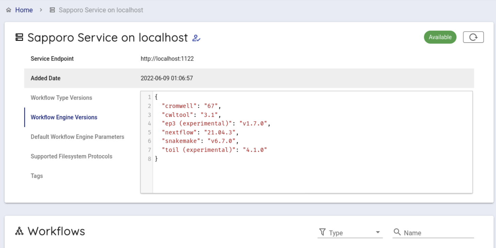
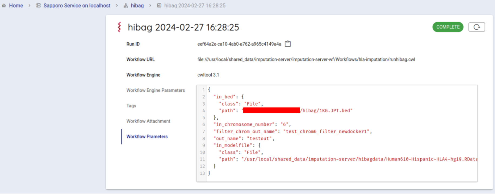

## Procedures for using this system

This system executes HLA Genotype Imputation workflows using [HIBAG](https://bioconductor.org/packages/release/bioc/html/HIBAG.html) in the following steps.

1. Prepare test data
2. Generate a configuration file for HLA Genotype Imputation Workflow
3. Execute the HLA Genotype Imputation Workflow

## 1. Prepare test data

To proceed with the tutorial, download the test input data and copy it to the Personal Genome Analysis division of the NIG supercomputer.
The required data for input to this workflow are PLINK bed, bim, and fam files.

### Preparation of PLINK bed, bim, and fam files

Access [Test data for Imputation Server HIBAG Workflow](https://zenodo.org/records/10579034).
You can find the following three files.

- `1KG.JPT.bim`
- `1KG.JPT.fam`
- `1KG.JPT.bed`

Download all `1KG.JPT.bim`, `1KG.JPT.fam`, and `1KG.JPT.bed` files.



### Copy it to Personal Genome Analysis division of the NIG supercomputer

Copy the test data just downloaded.

First, connect the VPN for connecting to the NIG supercomputer.

Next, use the following command to copy the test data that you have just downloaded.
(Please place all PLINK files in the same directory.)

In the following example, the test data you want to copy are in the download folder, and the copy destination is the home directory of your account in the Personal Genome Analysis division of the NIG supercomputer.

```
scp -i secret_key_file ~/Downloads/1KG.JPT.bim (your_account_name)@gwa.ddbj.nig.ac.jp:~/
scp -i secret_key_file ~/Downloads/1KG.JPT.fam (your_account_name)@gwa.ddbj.nig.ac.jp:~/
scp -i secret_key_file ~/Downloads/1KG.JPT.bed (your_account_name)@gwa.ddbj.nig.ac.jp:~/
```

Test data is now prepared.

## 2. Generate a configuration file for the HLA Genotype Imputation Workflow

Access the following address via guacamole of the NIG Supercomputer.

```
http://localhost:5000/hibag
```

When you actually access it, you will see the following screen.


Configure the following items.

- Path to the PLINK bed file
- Selection of the HIBAG model provided by this system
- Prefix name for the file(s) output by this workflow

For "Path to the PLINK bed file," specify the full path to the bed file to be parsed.
Here, the file that you uploaded is used.
The specific full path will be like `/home/youraccountname/1KG.JPT.bed`.

Next, select options for the HIBAG model.
You can choose for the following three.

1. Genotyping platform
2. Resolution
3. Ancestry

Finally, input the prefix name for the file(s) output by this workflow.

An input example is shown in the image below.


Here, after entering the path to the bed file input,

- Select `Illumina HumanOmni2.5 (based on HumanOmini2.5-8v1_C` from the dropdown list under `--Select a genotyping platform--`
- Select `Two-field (4-digit) resolution` from the dropdown list under `--Select a resolution--`
- Select `Asian` from the dropdown list under `-Select an ancestry--`

Then, input `1KG.JPT.hibag` into `Output file name prefix`.
(Note: You cannot include a path in `Output file name prefix`. Including `/` will cause an error.)

After specifying the parameters, press the "Set up job" button.
The generated parameters are displayed at the bottom of the screen.
Use this in sapporo-web.


## 3. Execute the HLA Genotype Imputation Workflow

Via guacamole, access the following address.

```
http://localhost:1121
```

When accessed, the following screen is displayed.


Select 'Sapporo Service on localhost', which is available by default.

When clicked, you can see the following screen.



Scroll down a little to use the backend workflows and select 'hibag' from the Workflows item and click it.


Select `cwltool 3.1` from the Workflow Engine item of Compose Run.


In Workflow Parameters, enter the parameters generated by `imputationserver-web-ui`.
In this case, delete the `{}` written from the beginning and enter the generated parameters.


Click the `EXECUTE` button at the bottom to execute the workflow. The job status will change to `RUNNING`.


When the workflow execution starts successfully, the workflow will be executed by cwltool.

If it runs correctly, the status will change to `COMPLETE` in about 10 minutes.



The result files can be obtained from the web browser. Click on `Outputs` in the Run log to view the list of result files.

When you click on the file you want to download, a dialog will appear, and by default, it will be downloaded under `~/Downloads`.

## Results

After executing the Imputation Workflow, the following can be obtained:

You can obtain it from the web browser.

You can copy the following command to your local computer.

Open a terminal.

Executing this command will download the file to the directory where the command is currently being executed.

`scp (your_account_name)@gwa.ddbj.nig.ac.jp:~/Downloads/(filename_you_want_to_download) .`

- `(your_account_name)` is the account you use to log in to the Individual Genome Analysis environment.
- `(filename_you_want_to_download)` specifies the name of the file you want to download.

Alternatively, you can directly download from the sapporo-service result directory.

Check the `Run ID`. What is displayed to the right of `Run ID` is the `Run ID`. By clicking on the icon to the right, you can copy the `Run ID`.


All files are located under the directory `/sapporo-install/sapporo-service/run/(first_2_characters_of_runid)/(runid)/outputs/`.

If the `runid` is `eef64a2e-ca10-4ab0-a762-a965c4149a4a`, the first 2 characters are `ee`.

When using scp to copy, input as follows on your local machine. A directory named `outputs` will be created on
