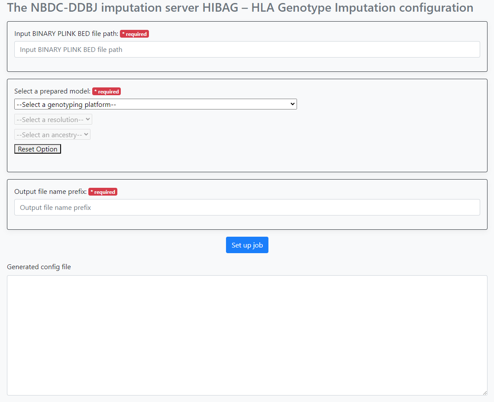
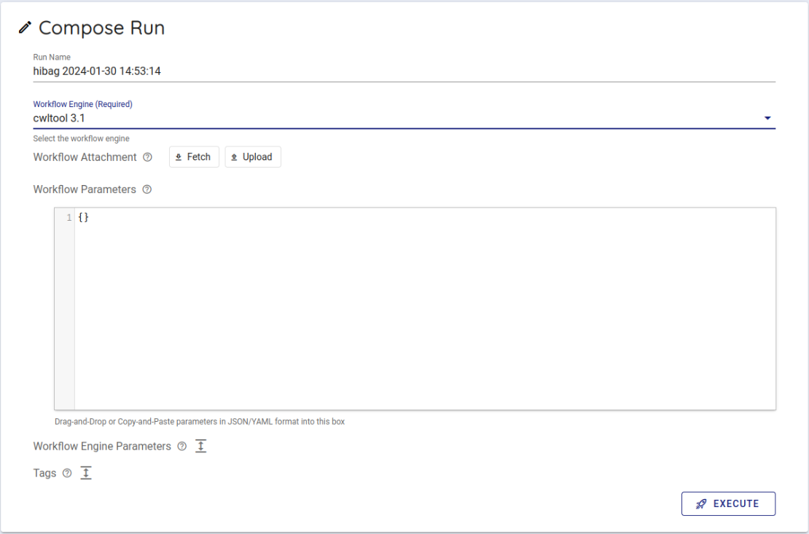
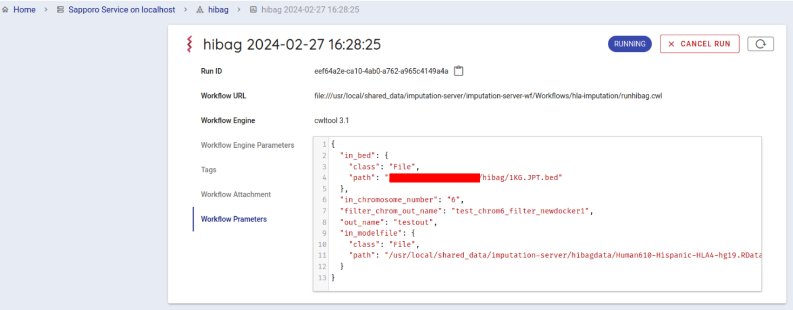

## System Usage

In this system, the HLA Genotype Imputation workflow using [HIBAG](https://bioconductor.org/packages/release/bioc/html/HIBAG.html) is executed following the steps below.

1. Preparation of test input data
2. Generation of configuration file for HLA Genotype Imputation Workflow
3. Execution of HLA Genotype Imputation Workflow

## Preparation of Test Input Data

To proceed with the tutorial, download the test input data and copy it to the Individual Genome Analysis Section of the NIG Supercomputer Center.
The required data for input to this workflow are PLINK bed, bim, and fam files.

### Preparation of PLINK bed, bim, and fam files

Access [Test data for Imputation Server HIBAG Workflow](https://zenodo.org/records/10579034). The following three files are available:

- `1KG.JPT.bim`
- `1KG.JPT.fam`
- `1KG.JPT.bed`

Download all `1KG.JPT.bim`, `1KG.JPT.fam`, and `1KG.JPT.bed` files.


### Copy to Individual Genome Analysis Section of NIG Supercomputer

Copy the downloaded test data.

Connect to the NIG Supercomputer via VPN.

Next, copy the downloaded test data with the following command. (Please place all PLINK files in the same directory.)

In the example below, the test data to be copied is located in the Downloads folder, and the destination is the home directory of your account in the Individual Genome Analysis Section of the NIG Supercomputer.

```
scp -i secret_key_file ~/Downloads/1KG.JPT.bim (your_account_name)@gwa.ddbj.nig.ac.jp:~/
scp -i secret_key_file ~/Downloads/1KG.JPT.fam (your_account_name)@gwa.ddbj.nig.ac.jp:~/
scp -i secret_key_file ~/Downloads/1KG.JPT.bed (your_account_name)@gwa.ddbj.nig.ac.jp:~/
```

With this, the preparation of test input data is complete.

## Generation of Configuration File for HLA Genotype Imputation Workflow

Access the following address via guacamole of the NIG Supercomputer.

```
http://localhost:5000/hibag
```

Upon actual access, the screen appears as follows.



Configure the following items:

- Path to the PLINK bed file
- Selection of the HIBAG model provided by this system
- Prefix name for the file(s) output by this workflow

For "Path to the PLINK bed file," specify the full path to the bed file to be analyzed. Here, use the uploaded file.
The specific full path will be like `/home/youraccountname/1KG.JPT.bed`.

Next, select options for the HIBAG model.
Selections are available for the following three:

1. Genotyping platform
2. Resolution
3. Ancestry

Finally, input the prefix name for the file(s) output by this workflow.

An input example is shown in the image below.


Here, after entering the path to the bed file input,

- Select `Illumina HumanOmni2.5 (based on HumanOmini2.5-8v1_C` from the dropdown list under `--Select a genotyping platform--`
- Select `Two-field (4-digit) resolution` from the dropdown list under `--Select a resolution--`
- Select `Asian` from the dropdown list under `-Select an ancestry--`

Then, input `1KG.JPT.hibag` into `Output file name prefix`.
(Note: You cannot include a path in `Output file name prefix`. Including `/` will cause an error.)

After specifying the parameters, click the "Set up job" button.
The generated parameters will be displayed at the bottom of the screen. These will be used in sapporo-web.


## Execution of Imputation Workflow

Access the following address via guacamole of the NIG Supercomputer.

```
http://localhost:1121
```

The following screen will be displayed.


Next, select the Sapporo Service on localhost, which is available by default.

Clicking will bring up the following screen.


Next, scroll down a bit to use the backend workflow, and click on `hibag` under Workflows.


From the Compose Run section, select `cwltool 3.1` under Workflow Engine.



Input the parameters generated earlier in the imputationserver-web-ui into Workflow Parameters. When doing so, delete the `{}` already written and input the generated parameters.


Click the `EXECUTE` button at the bottom to execute the workflow. The job status will change to `RUNNING`.



When the workflow execution starts successfully, the workflow will be executed by cwltool.

If it runs correctly, the status will change to `COMPLETE` in about 10 minutes.


The result files can be obtained from the web browser. Click on `Outputs` in the Run log to view the list of result files.

When you click on the file you want to download, a dialog will appear, and by default, it will be downloaded under `~/Downloads`.

## Results

After executing the Imputation Workflow, the following can be obtained:

You can obtain it from the web browser.

You can copy the following command to your local computer.

Open a terminal.

Executing this command will download the file to the directory where the command is currently being executed.

`scp (your_account_name)@gwa.ddbj.nig.ac.jp:~/Downloads/(filename_you_want_to_download) .`

- `(your_account_name)` is the account you use to log in to the Individual Genome Analysis environment.
- `(filename_you_want_to_download)` specifies the name of the file you want to download.

Alternatively, you can directly download from the sapporo-service result directory.

Check the `Run ID`. What is displayed to the right of `Run ID` is the `Run ID`. By clicking on the icon to the right, you can copy the `Run ID`.


All files are located under the directory `/sapporo-install/sapporo-service/run/(first_2_characters_of_runid)/(runid)/outputs/`.

If the `runid` is `eef64a2e-ca10-4ab0-a762-a965c4149a4a`, the first 2 characters are `ee`.

When using scp to copy, input as follows on your local machine. A directory named `outputs` will be created on
