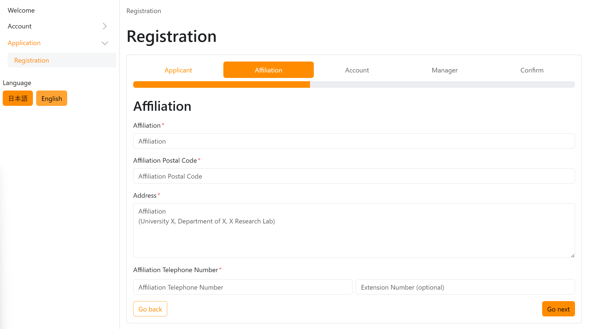

&#x26A0;  If you have already completed an application for use but without registering your SSH public key, refer to [<u>FAQ : Application/Billing > FAQ(Application for New Use)</u>](/faq/faq_NewUser_registration#when-applying-for-new-use-i-applied-for-use-without-entering-my-ssh-public-key-in-the-usage-registration-application-form-i-have-already-completed-the-application-for-use-but-without-registering-my-ssh-public-key-what-should-i-do).

## Application for use

[&#x1f517;<u>Application for use is accepted</u>](https://sc-account.ddbj.nig.ac.jp/en/application/registration) at any time. 

- 1TB of high-speed storage is available after application for use.
- If you extend the available storage or use a billing service, [<u>submit a usage plan table</u>](/en/application/resource_extension) after your application has been accepted.
  - &#x26A0;  Currently, we are not accepting application for new use of the personal genomic analysis section and large-scale storage on the general analysis section. For more information, [<u>refer to this announcement page</u>](/en/blog/2022-05-13-suspension-of-applications).

<table>
<tr>
<td width="400" valign="top">

</td>
<td width="400" valign="top">

Create an SSH public key. 
For instructions on how to create it, see below. 
<ol>
<li><a href="https://sc.ddbj.nig.ac.jp/en/application/ssh_keys"><u>Linux</u></a></li>
<li><a href="https://sc.ddbj.nig.ac.jp/en/application/ssh_keys_mac"><u>Mac</u></a></li>
<li><a href="https://sc.ddbj.nig.ac.jp/en/application/ssh_keys_windows"><u>Windows</u></a></li>
</ol>

</td>
</tr>

<tr>
<td width="400" valign="top">

</td>
<td width="400" valign="top">

[&#x1f517;<u>Access the page of registration application for use</u>](https://sc-account.ddbj.nig.ac.jp/en/application/registration). When you access that page, the screen shown on the left is displayed. Enter the form and click 'Next'.

- To prevent electronic mail erroneous transmission, enter your email address of the organization you belong to, not a free email address.
- Enter ACCURATELY the purpose of use. Use of the supercomputer for purposes other than those entered here is prohibited.
    

</td>
</tr>

<tr>
<td>

</td>
<td>

Enter the address of your institution and click 'Next'. 

- An account certificate will be sent by post to your institution you have entered to verify your identity.

</td>
</tr>

<tr>
<td>

</td>
<td>

- Copy and paste the SSH public key created in the first step into the form to register it. 
For instructions on how to register by copying and pasting, see below.

1. [<u>Linux</u>](/application/ssh_keys/#register_the_ssh_public_key_to_the_nig_supercomputer)
2. [<u>Mac</u>](/application/ssh_keys_mac/#register-the-ssh-public-key-with-the-nig-supercomputer)
3. [<u>Windows</u>](/application/ssh_keys_windows#register-the-ssh-public-key-with-the-nig-supercomputer)

- Enter here if you already have a JGA or AGD account.
If you do not have one, do not enter anything.
- If you use the personal genome analysis section, tick the box at the bottom.

</td>
</tr>

<tr>
<td>

</td>
<td>

For security traceability reasons, we ask you to designate a responsible person when applying for use.
[<u>For more information on how to designate a responsible person, see here</u>](/en/application/#the-responsible-person).

- If you know both the account name and the group name of the responsible person, enter them in the form at the top.
This allows you to omit entering the detailed data about the responsible person.

- Click the check box in the following cases. After clicking the check box, the screen shown on the left is displayed. Then enter the information of the responsible person.
  - If the account name of the responsible person is known, but the group name is unknown.
  - If neither the account name nor the group name of the responsible person is known.
  - Note: If an incorrect email address is entered, the application information can be compromised due to erroneous transmission, for which no liability can be accepted.

- If you do not know the account name of the responsible person and the group name, [<u>refer to FAQ</u>](/faq/faq_NewUser_registration/#what-should-i-enter-account-name-and-group-name-of-the-responsible-person).

</td>
</tr>

<tr>
<td>

</td>
<td>
The DDBJ will normally contact the applicant and the responsible person by email within one week after completion of the application.

The application for use is completed when the 'Completed' screen appears, as shown on the left. 
After the application for use has been completed, DDBJ will normally send an email to the applicant and the responsible person within one week.
</td>
</tr>

</table>

## Change of application details

If your affiliation or other details change, immediately [&#x1f517;<u>change your application details here</u>](https://sc-account.ddbj.nig.ac.jp/en/login).

<table>
<tr>
<td width="400" valign="top">

</td>
<td width="400" valign="top">
Login to your account page. 
Click on the URL below to access the change application details page. When accessed, you can see first a login screen to the page. Enter your account name and password. Click 'Sign In' 

&#x1f517;<u>https://sc-account.ddbj.nig.ac.jp/en/login</u>

</td>
</tr>

<tr>
<td width="400" valign="top">

</td>
<td width="400" valign="top">

When you click 'Sign In', if the screen shown on the left is displayed, click 'Sing in with Keycloak'. 
If you can login to your account page without being displayed, skip ahead.

</td>
</tr>

<tr>
<td>

</td>
<td>
After logging in, your account page is displayed as shown on the left. 

From the left menu, you can change your affiliation, SSH public key, password, etc., or request for termination of your account.

</td>
</tr>
</table>

