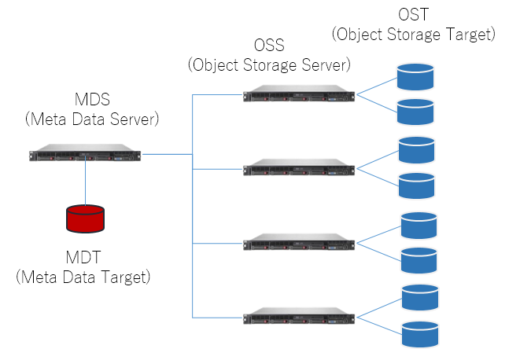

遺伝研スパコンの一般解析区画、個人ゲノム解析区画ともホーム領域はLustre File Systemで構成されています。

## Lustre File Systemの構造


Lustreはスパコンで広く用いられている並列分散共有ファイルシステムです。
複数のサーバとディスクアレイ装置からファイルシステムが構成されています。

- MDS (Meta Data Serve)：ファイルのメタ情報、ファイル名・サイズ・所有者・実際のデータの在処等へのアクセスを管理するサーバー。MDTをマウントしている。
- MDT(Meta Data Target)：ファイルシステムメタデータを保持しているストレージ領域。
- OSS (Object Storage Server)：ファイルデータへのアクセスを管理するサーバー。OSTをマウントしている。
- OST(Object Storage Target)：ファイルシステム内のデータの実体を保持しているストレージ領域。



考：https://ddn.co.jp/issue/lustre.html


## Quotaの確認方法

各ユーザに対して使用可能なストレージ容量の制限(quota)が掛かっています。


ユーザの現在のホーム領域の使用状況およびquota設定は”lfs quota”コマンドで確認することができます。

```bash
[username@at027 ~]$ lfs quota -u username /lustre7
Disk quotas for usr username (uid ****):
 Filesystem  kbytes   quota   limit   grace   files   quota   limit   grace
   /lustre7    1840       0  1000000000     -      23       0       0       -
```


| 項目     | 意味・説明                                   |
|----------|----------------------------------------------|
|kbytes    | 使用中のファイル容量(KB)                     |
|quota 	   | ファイル容量/数の制限値（ソフトリミット）    |
|limit 	   | ファイル容量/数の絶対制限値(ハードリミット)  |
|grace 	   | 制限値超えの許容期間(本システムでは未設定)   |
|files 	   | 使用中のファイル数                           |
 
上記のコマンド例ではユーザはLustre7において1TBのquota設定がされており、現在の使用量は1,840KBです。
使用量が1TBを超えると新規書き込みが出来なくなります。必要に応じて大規模利用申請をしてください。
なお、ファイル数に対しては今のところ制限を設けておりません。


 
## ストライピング設定方法

Lustreの特長は、1つのファイルを複数のセグメントに分割し、これを複数のOST上に分散して格納できることです。この機能をファイルストライピング(file striping)と呼びます。 ファイルストライピングのメリットは、一つのファイルが複数のOST上に分割して格納される為、それに対してクライアントから並列にread/writeを実行可能で、大容量のファイルについては 高速にread/writeができることです。 一方でファイルストライピングをすると複数のOST上に分散される為、分散したデータのハンドリングのオーバーヘッドが増大します。 この為、ストライピング設定は、対象となるファイルサイズが1GB以上のときに設定して頂くと高速化が期待できます。ストライピング設定はディレクトリ毎にユーザ自身で実施いただけます。設定するとそのディレクトリ以下への新規ファイルの書き込みが指定したOST数に分散されるようになります。

 

### ストライピング設定例

テスト用のディレクトリを作成します。デフォルトではストライピングが掛かっておらずstripe_count: 1になっています。lfs getstripeコマンドで確認します。

```bash
[username@at027 ~]$ mkdir stripe_test
[username@at027 ~]$ lfs getstripe stripe_test
stripe_test
stripe_count:  1 stripe_size:   1048576 stripe_offset: -1
```

この場合に該当ディレクトリ下でファイルを作成すると1つのOSTのみを使用しています。

```bash
[username@at027 ~]$ cd stripe_test
[username@at027 stripe_test]$ touch test1
[username@at027 stripe_test]$ lfs getstripe test1
test1
lmm_stripe_count:  1
lmm_stripe_size:   1048576
lmm_pattern:       1
lmm_layout_gen:    0
lmm_stripe_offset: 37
        obdidx           objid           objid           group
            37        47983333      0x2dc2ae5                0
```

ディレクトリにストライピングの設定をします(4 or 8を推奨します)。lfs setstripeコマンドで設定します。

```bash
[username@at027 stripe_test]$ cd ..
[username@at027 ~]$ lfs setstripe -c 8 stripe_test
```

ストライピング設定が入り`stripe_count: 8`となっています。

```bash
[username@at027 ~]$ lfs getstripe stripe_test
stripe_test
stripe_count:  8 stripe_size:   1048576 stripe_offset: -1
stripe_test/test1
lmm_stripe_count:  1
lmm_stripe_size:   1048576
lmm_pattern:       1
lmm_layout_gen:    0
lmm_stripe_offset: 37
        obdidx           objid           objid           group
            37        47983333      0x2dc2ae5                0
```

ディレクトリ下でファイルを作成すると8つのOSTに分散して書き込まれています。

```bash
[username@at027 ~]$ cd stripe_test
[username@at027 stripe_test]$ touch test2
[username@at027 stripe_test]$ lfs getstripe test2
test2
lmm_stripe_count:  8
lmm_stripe_size:   1048576
lmm_pattern:       1
lmm_layout_gen:    0
lmm_stripe_offset: 7
        obdidx           objid           objid           group
             7        47380852      0x2d2f974                0
            23        46480541      0x2c53c9d                0
            16        46580671      0x2c6c3bf                0
            22        48432161      0x2e30421                0
            35        46545298      0x2c63992                0
            47        47992978      0x2dc5092                0
             5        47575428      0x2d5f184                0
            27        47862271      0x2da51ff                0
```
 


## Lustre利用時のTips

Lustreファイルシステムは一般的にファイルサイズの大きいファイルへのアクセスやシーケンシャルアクセス、異なるファイルへの並列アクセスに適しています。使い方によっては期待する性能が出ない場合があります。以下に該当する際は留意ください。

### 大量のファイルを扱いたい場合

Lustreはメタデータは、MDSで一元管理される為、メタデータ操作(ls -lや大量の小サイズファイルの作成等)を伴うファイル操作は、MDSに負荷が 集中し、ローカルファイルシステム上の同等操作に比較して高速ではありません。その点に注意し、同一ディレクトリ上に数万の 小サイズのファイルを置くなどの操作は避け、複数のディレクトリに分けて格納することを推奨します。1ディレクトリあたり5,000ファイル以下を目安としてください。

### 特定ファイルに集中アクセスをするジョブの場合

容量がGB単位以上のファイルの場合はストライピング設定をして頂くことでアクセス性能が向上します。または、ファイルを各計算ノードのローカルディスク(/data1)に計算時にコピーし、ローカルディスクに対してアクセスするようにして下さい。


## Lustre on demand(LustreOD)サービス

特定ファイルに集中アクセスする必要がある場合、各計算ノード内に取り付けられているNVMe SSDを束ねてLustre FSを構成することにより処理速度を大幅に向上させることが出来ます。


各計算ノードのローカルディスク(/data1の場合3.2TBのNVMe SSD)をMDTまたはOSTとして利用し、各計算ノードでMDS,OSSのサービスを起動することで専用のLustreファイルシステムを構成することが可能です。この専用Lustreを占有利用することで共有Lustreとは独立して計算処理をして頂けます。

ご利用になるためには計算ノードを占有利用する課金サービスの申請をしてください。占有利用した計算ノードのローカルディスクを使用してLustreファイルシステムを構成させて頂きます。

LustreODの性能ですが、構成にも左右されますが計算ノード3台構成(MDS1台+OSS2台)においてIORで測定した場合、Readが4.1GB/sec、Writeが1.9GB/sec程度でした。
