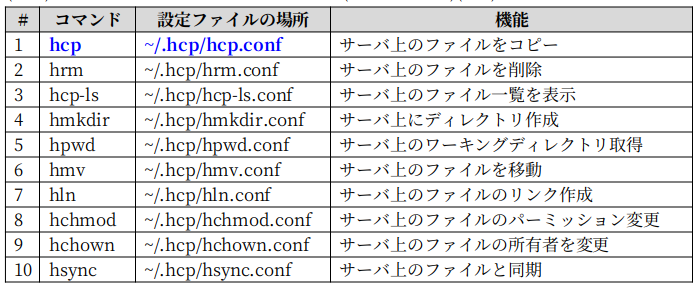

## 設定ファイルの種類

HCP toolsの各コマンドのそれぞれに対し、設定ファイルがあります。




設定ファイルがたくさんあるので、共通の設定を記載するための新しい設定ファイルを`~/.hcp/hcp-common.conf`という名前で作成し、各設定ファイルからインクルード（読み込み）する方法を推奨します。`~/.hcp/hcp.conf`などの上記10個の設定ファイルの冒頭に以下の一行を記載して下さい。（パスは絶対パスで書く必要があります。）

Linuxの場合

```
Include /home/ユーザ名/.hcp/hcp-common.conf
```

Windowsの場合

```
Include C:\Users\ユーザ名\_hcp\hcp-common.conf
```


## 共通設定ファイル(`~/.hcp/hcp-common.conf`)の設定例

`hcp-common.conf`の内容は、通常は以下の通りとして下さい。

```
PrivateKeyFile /home/ユーザ名/.ssh/id_rsa    # 秘密鍵指定
AcceptableCryptMethod   PLAIN              　# 暗号化:なし
AcceptableDigestMethod  SHA256               # ダイジェスト方式: SHA256
DisableDataIntegrityChecking yes             # ダイジェスト方式なしを許可
```

(Windowsの場合は秘密鍵へのパスを`C:\Users\ユーザ名\.ssh\id_rsa`として下さい。)

### 秘密鍵指定

HCP toolsは、公開鍵・秘密鍵によりユーザ認証を行います。

この場合の公開鍵・秘密鍵は遺伝研スパコンのSSHログインに用いる公開鍵・秘密鍵ファイルで構いません。
これらを用いる場合は、クライアントマシンのユーザディレクトリ(Windowsの場合は`C:\Users\ユーザ名\.ssh`)の下に秘密鍵ファイル(`id_rsa`)が置かれていることを確認してください。（[SSHの公開鍵の設定方法](/application/ssh_keys)に従うとすでに秘密鍵ファイルがここに置かれているはずです。）

### 暗号化

個人ゲノム解析区画はSSL-VPNを使っているので、HCPtoolsによる暗号化は通常は必要ありません。
したがって、以下の内容のファイルを作成し`~/.hcp/hcp-common.conf`として設置すれば通常問題ありません。

### ダイジェスト方式

転送途中でデータの破損・改ざんがないことを確認するための設定です。通常はこの設定を有効にして下さい。
ファイルの完全性のチェックを行う場合は`-y`オプションをつけて下さい。

例

```bash
hcp --user ユーザ名 --hpfp -y  \
    gwa.ddbj.nig.ac.jp:/home/your_account-pg/some_directory/your_file.txt \
    C:\Users\ユーザ名\your_file.txt
```


